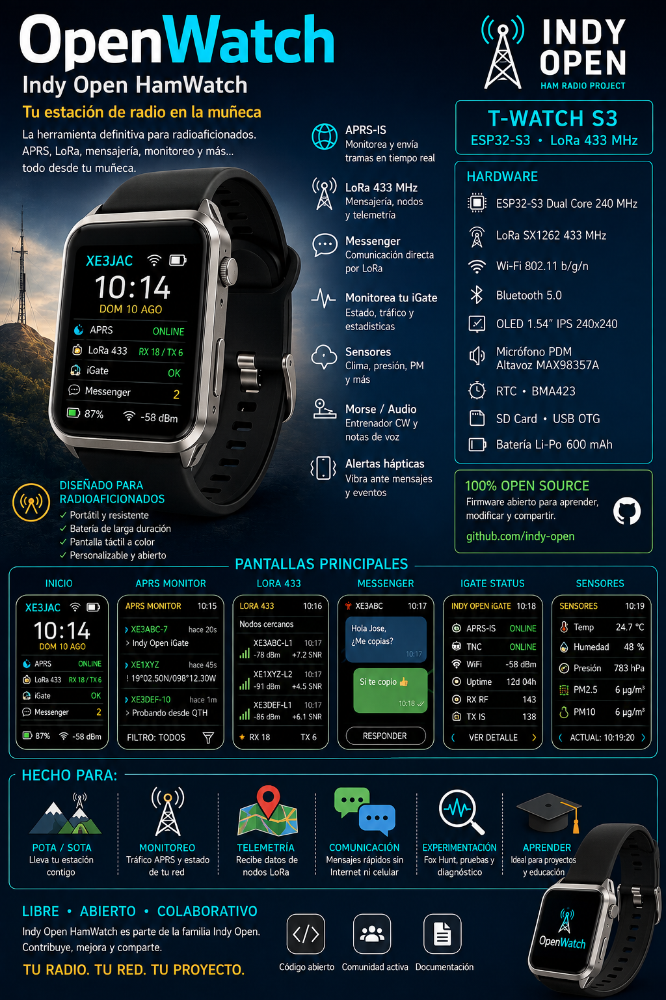

# ⌚📡 Indy Open Ham T-Watch S3

## Tu estación de radio en la muñeca.  

### Imagen Generada con IA.

**Indy Open Ham T-Watch S3** es un proyecto abierto de la familia **Indy Open**, orientado a crear nuevas herramientas para radioaficionados utilizando el **LILYGO T-Watch S3**.

La idea es aprovechar su **ESP32-S3**, pantalla táctil, conectividad Wi-Fi/Bluetooth y radio **LoRa 433 MHz** para convertirlo en una plataforma portátil de experimentación para APRS, mensajería, telemetría, monitoreo y otras funciones relacionadas con radioafición.

> [!IMPORTANT]
> ## 🚧 PROYECTO EN DESARROLLO
>
> **Indy Open Ham T-Watch S3 se encuentra actualmente en desarrollo activo.**
>
> Las características, pantallas, funciones e integraciones descritas en este repositorio representan la visión y los objetivos actuales del proyecto.
>
> ⚠️ **Las funcionalidades pueden cambiar, añadirse, modificarse o eliminarse durante el proceso de desarrollo y pruebas.**
>
> Algunas funciones mostradas en la documentación y material promocional son conceptos previstos y **pueden no estar implementadas todavía**.
>
> Si quieres seguir la evolución del proyecto, utiliza ⭐ **Star** y 👀 **Watch** en GitHub para recibir las próximas actualizaciones.

# WEBFLASHER - Indy Open Ham T-Watch S3
## https://xe3jac.github.io/Indy-Open-T-Watch-S3/s3-webflasher/

# Indy Open Ham T-Watch S3
# https://xe3jac.github.io/Indy-Open-T-Watch-S3/

**Para poder realizar el envió de balizas con posicionamiento desde el reloj se debe instalar la app de Android
que permitirá conectar el reloj por medio del Bluetooth al teléfono para obtener la ubicación GPS además de actualizar la hora y la fecha.**

**Nota:** No es indispensable solo se requiere si se desea enviar balizas con ubicación todas las demás características estarán disponibles.

---

## 🚀 ¿Qué queremos hacer?

Indy Open HamWatch busca convertirse en una pequeña plataforma abierta para llevar herramientas de radioafición directamente a la muñeca.

Entre las funciones que estamos explorando se encuentran:

- 💬 Indy Open Messenger con LoRa 433 MHz 
- 📊 Monitor de Indy Open iGate
- 🌡️ Visualización de sensores
- 📳 Alertas mediante vibración
- 🔊 Herramientas de audio
- 📶 Información RSSI / SNR
- 〰️ Entrenador CW / Morse
- 🦊 Fox Hunt mediante LoRa
- 🌐 Wi-Fi
- 🔵 Bluetooth

Y seguramente aparecerán nuevas ideas durante el desarrollo.

---

## 📡 APRS

Cuando exista conexión Wi-Fi, OpenWatch podrá explorar funciones relacionadas con **APRS / APRS-IS**.

Entre los objetivos se encuentran:

- Monitor de estaciones
- Visualización de últimas tramas
- Mensajes APRS
- Alertas dirigidas al usuario
- Estado de Indy Open iGate
- Información de actividad de red

---

## 🔧 Hardware objetivo

El desarrollo inicial está pensado para:

### LILYGO T-Watch S3

Características que queremos aprovechar:

- ESP32-S3
- LoRa SX1262
- 433 MHz
- Wi-Fi
- Bluetooth
- Pantalla táctil IPS 240 × 240
- RTC
- Acelerómetro BMA423
- Micrófono PDM
- Amplificador de audio MAX98357A
- Motor háptico
- USB OTG
- Gestión integrada de batería

---

## 🦊 Ideas futuras

OpenWatch pretende ser una plataforma experimental y abierta.

Algunas funciones que podremos investigar posteriormente:

- Fox Hunt LoRa
- Balizas
- Entrenador Morse
- Generador CW
- Notas de voz
- Telemetría
- Mapas simplificados
- Alertas APRS
- Comunicación con Indy Open LoRa
- Control remoto de Indy Open iGate
- Herramientas para POTA / SOTA
- Diagnóstico de enlaces LoRa

---

## ⭐ Sigue el proyecto

Si te interesa OpenWatch:

- ⭐ Dale una **Star** al repositorio
- 👀 Usa **Watch** para recibir actualizaciones
- 🍴 Haz **Fork** si quieres experimentar
- 💡 Comparte ideas y sugerencias
- 🐛 Reporta errores
- 🤝 Contribuye al desarrollo

Cada colaboración ayuda a que el proyecto siga creciendo.

---

## ☕ Apoya el proyecto

Indy Open es un proyecto comunitario desarrollado por interés en la radioafición, la experimentación y el hardware/software abierto.

Si quieres ayudar a continuar desarrollando placas, probando hardware y creando nuevas funciones, podrás apoyar voluntariamente el proyecto.

❤️ **Las donaciones son completamente opcionales.**

**¡Gracias por apoyar Indy Open APRS! 73 de XE3JAC**
